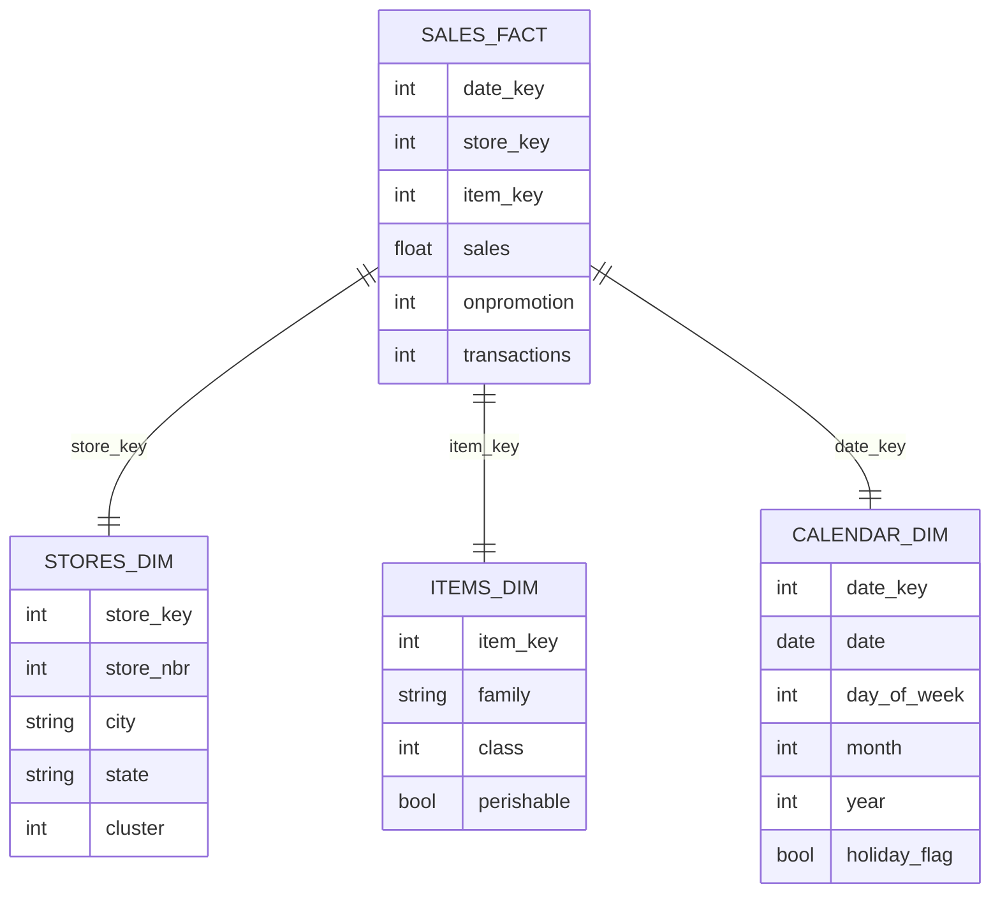
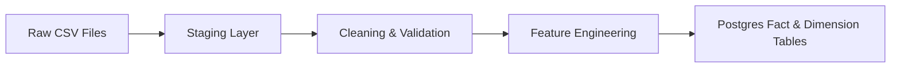

<p align="center">
  
  
  
  
  
  
  
  
</p>

---

# 📘 **Retail Demand Forecasting — End‑to‑End MLOps Project**

A complete **Retail Demand Forecasting System** built using:

- **Python (FastAPI, MLflow, SHAP, CatBoost, LightGBM, XGBoost)**  
- **Postgres SQL (Star Schema)**  
- **Docker + Docker Compose**  
- **GitHub Actions CI**  
- **Power BI Dashboard**  
- **MLflow Tracking + Model Registry**  
- **Production Logging & Environment Variables**

This project demonstrates a full **MLOps workflow**:  
**Raw data → ETL → Feature engineering → Model training → MLflow tracking → Model registry → FastAPI deployment → Monitoring.**

---

# 🏗️ **Architecture Overview**

### ✔ Mermaid Architecture Diagram (GitHub‑compatible)

```mermaid
flowchart TD
    A[Raw Data (Kaggle)] --> B[ETL Pipeline (Python + SQL)]
    B --> C[Feature Store (Postgres)]
    C --> D[Model Training (CatBoost, LightGBM, XGBoost)]
    D --> E[MLflow Tracking + Model Registry]
    E --> F[FastAPI Prediction Service]
    F --> G[Docker Deployment (API + DB)]
    G --> H[Power BI Dashboard]
```

---

# 📊 **Dataset Description**

Dataset: **Corporación Favorita Grocery Sales Forecasting (Kaggle)**  
Granularity: Daily sales per store per product family  
Key fields:

- `store_nbr`  
- `family`  
- `sales`  
- `onpromotion`  
- `transactions`  
- `date`

Time range: **2013–2017**

---

# 🧱 **SQL Star Schema**

### ✔ Mermaid ER Diagram (GitHub‑compatible)



---

# 🔄 **ETL Workflow**



---

# 🧪 **Feature Engineering**

| Feature | Description |
|--------|-------------|
| `lag_1`, `lag_7`, `lag_14` | Prior sales values |
| `rolling_mean_7`, `rolling_mean_30` | Moving averages |
| `onpromotion` | Promotion flag |
| `transactions` | Store traffic |
| `month`, `day_of_week` | Calendar features |

---

# 🤖 **Model Training & Comparison**

Models trained:

- CatBoost  
- LightGBM  
- XGBoost  
- Linear Regression  

Metrics logged to MLflow:

- MAE  
- RMSE  
- MAPE  
- RMSLE  
- Training time  
- Feature importance  

---

# 🔍 **SHAP Explainability**

Generated SHAP plots:

- Summary plot  
- Feature importance bar chart  
- Dependence plots  

Key insights:

- Lag features dominate predictions  
- Promotions significantly boost demand  
- Transactions correlate strongly with sales  

---

# ⚡ **FastAPI Prediction Service**

### Endpoints

#### `GET /`
Health check

#### `POST /predict`
Predict next‑day demand using MLflow Production model:

```
models:/retail_forecasting_model/Production
```

CI uses a **mock model** for stability.

---

# 🐳 **Docker Usage**

### Build & Run

```
docker compose up --build
```

Services:

- `api` → FastAPI  
- `postgres` → Database  

---

# 📈 **MLflow Tracking & Model Registry**

Includes:

- Experiment runs  
- Metrics  
- Artifacts  
- Registered models  
- Production model  

MLflow UI:

```
http://127.0.0.1:5000
```

---

# 🧪 **GitHub Actions CI**

Badge:

```

```

Pipeline:

- Install dependencies  
- Run tests  
- Use mock MLflow model  
- Validate FastAPI endpoints  

---

# 📊 **Power BI Dashboard**

Includes:

- Store‑level forecasting  
- Family‑level trends  
- Promotion impact  
- Seasonal patterns  
- Drill‑through pages  

---

# 🛠️ **Project Structure**

```
retail-demand-forecasting/
│
├── app/
│   ├── main.py
│   ├── predictor.py
│   ├── logging_config.py
│
├── src/
│   ├── train.py
│   ├── etl.py
│   ├── features.py
│
├── tests/
│   ├── test_api.py
│
├── models/
│   ├── metrics.csv
│
├── data/
├── database/
├── notebooks/
├── powerbi/
├── reports/
│
├── images/
│   ├── xgboost_prediction.png
│   ├── lightgbm_prediction.png
│
├── .github/
├── Dockerfile
├── docker-compose.yml
├── requirements.txt
├── README.md
└── LICENSE
```

---

# 🚀 **Future Improvements**

- Hyperparameter tuning (Optuna)  
- Model monitoring (Prometheus + Grafana)  
- Drift detection (Evidently AI)  
- Batch inference pipeline  
- Real‑time streaming (Kafka)  
- Kubernetes deployment  
- Feature Store (Feast)  
- Automated retraining pipeline  

---

# 📝 **License**

MIT License
